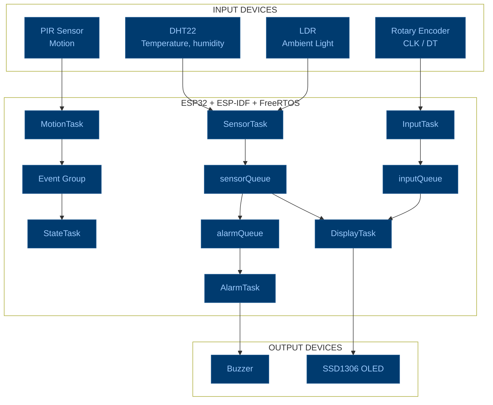
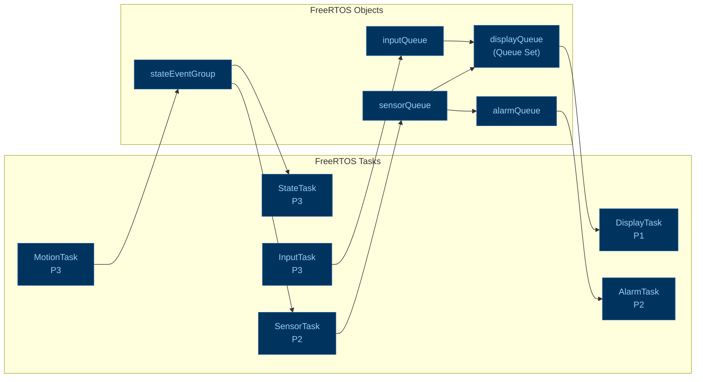
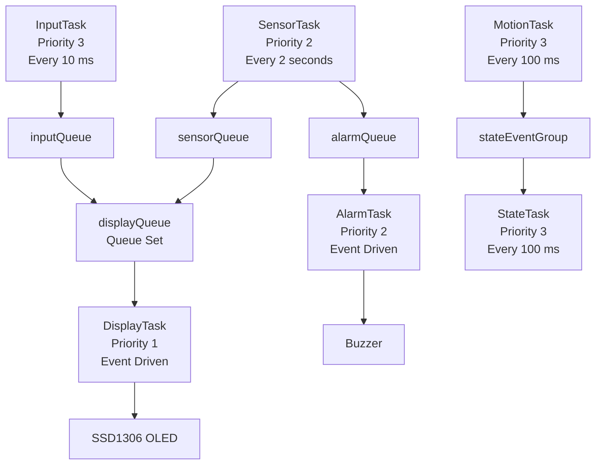
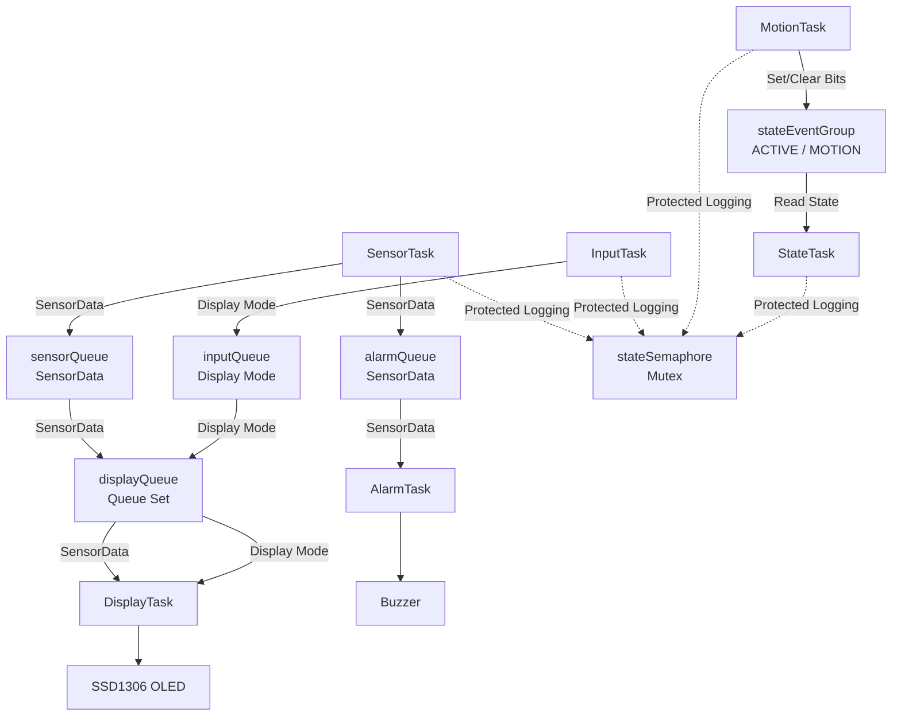
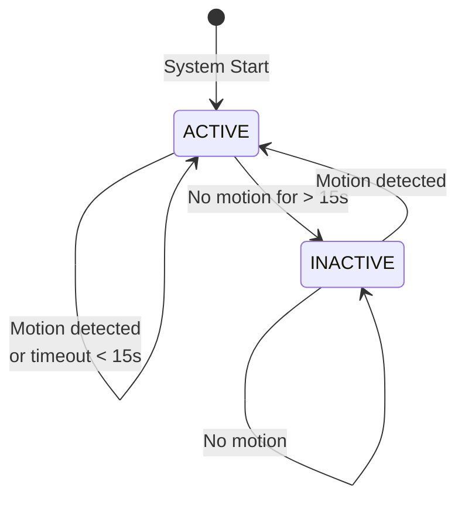

# FreeRTOS Multisensor Room Monitoring System

## Project Overview
An ESP32 room-monitoring system built on native ESP-IDF and simulated in Wokwi. It samples temperature, humidity and ambient light, detects motion with a PIR sensor, lets a user browse the readings on an OLED with a rotary encoder, and alarms using a buzzer when temperature triggers at 18°C and below, or 30°C and above. Temperatures strictly between these two values are normal. The system also tracks an ACTIVE/INACTIVE state based on recent motion, blanking the display after 15 seconds of inactivity.

## Features
- Temperature and humidity sampling from a DHT22 (custom bit-banged driver, protected by a critical section during the timing-sensitive 40-bit read).
- Ambient light sampling from an LDR via ADC2, converted to a calibrated 0–100% scale (`Dark`/`Bright` raw-value constants).
- OLED (SSD1306, I2C) paging between Temperature / Humidity / Light / Motion, navigated with an interrupt-driven rotary encoder.
- Temperature alarm (buzzer via LEDC PWM) with hardware-independent decision logic.
- Motion-based ACTIVE/INACTIVE system state with a 15-second inactivity timeout.
- Six FreeRTOS tasks coordinated through three queues, a `QueueSet`, a mutex, and an event group.

## Learning Objectives

By completing this project, we should be able to:

1. Setup and build an ESP32 project using the native **ESP-IDF framework** through **PlatformIO** in VS Code.

2. Simulate an ESP32-based circuit using the **Wokwi extension**.

3. Implement custom APIs/libraries for sensors and actuators while utilizing built-in **ESP-IDF drivers**.

4. Create and manage multiple **FreeRTOS tasks**, including assigning appropriate task priorities.

5. Understand and apply **Blocking, Non-Blocking Delays, and Polling-based implementations** effectively within FreeRTOS tasks.

6. Implement **Inter-Task Communication (ITC)** using FreeRTOS **Queues, Event Groups, and State Machines**.

7. Utilize **Mutex (Mutual Exclusion)** to synchronize access to shared resources and prevent resource corruption.

8. Apply **unit testing and static analysis** to improve software reliability, maintainability, and code quality.

## System Architecture



## FreeRTOS Architecture



What the diagram represents:
```text
                    ┌─────────────────────────────────┐
                    │          FreeRTOS Tasks         │
                    │                                 │
                    │ SensorTask   DisplayTask        │
                    │ InputTask    AlarmTask          │
                    │ MotionTask   StateTask          │
                    └───────────────┬─────────────────┘
                                    │
                                    ▼
                    ┌─────────────────────────────────┐
                    │      FreeRTOS Communication     │
                    │                                 │
                    │ sensorQueue   alarmQueue        │
                    │ inputQueue    displayQueue      │
                    │ stateEventGroup                 │
                    │                                 │
                    └───────────────┬─────────────────┘
                                    │
                                    ▼
                    ┌─────────────────────────────────┐
                    │          System Functions       │
                    │                                 │
                    │ OLED Display   Temperature      │
                    │                Alarm            │
                    │ System State   Motion State     │
                    └─────────────────────────────────┘     
```        
## Hardware/Simulated Components & Pin Configurations

This project uses an **ESP32** as the main controller and is simulated using **Wokwi**.

| Component | Purpose | GPIO / Interface |
|---|---|---|
| **ESP32** | Main microcontroller running ESP-IDF and FreeRTOS | — |
| **DHT22** | Measures temperature and humidity | GPIO 18 |
| **LDR (Light Sensor)** | Measures ambient light intensity and converts it to 0–100% | ADC2 / GPIO 34 |
| **PIR Sensor** | Detects motion | GPIO 19 |
| **Rotary Encoder** | Navigates between display modes | CLK: GPIO 32 / DT: GPIO 33 |
| **SSD1306 OLED** | Displays temperature, humidity, light, and motion readings | I2C: SDA GPIO 21 / SCL GPIO 22 |
| **Buzzer** | Produces an alarm when temperature is outside the safe range | GPIO 27 |
| **Wokwi Simulator** | Simulates the complete hardware setup for testing | Virtual |

### Display Modes
The rotary encoder allows the user to switch between:

- **Temperature**
- **Humidity**
- **Light**
- **Motion**

### Temperature Alarm
The buzzer is controlled based on the measured temperature:

- **Below 18 °C** → Low Temperature Alarm
- **Above 30 °C** → High Temperature Alarm

## Task Design

The system is divided into six FreeRTOS tasks. Each task has a specific responsibility and uses FreeRTOS communication mechanisms to coordinate with other tasks.

| Task            | Priority | Stack Size | Period / Blocking                     | Main Responsibility                                                                                  |
| --------------- | -------: | ---------: | ------------------------------------- | ---------------------------------------------------------------------------------------------------- |
| **SensorTask**  |        2 |       4096 | Every 2 seconds                       | Reads temperature, humidity, and light data, then sends the readings to the sensor queues and alarm queues. |
| **DisplayTask** |        1 |       4096 | Blocks until data is available        | Receives sensor queue or input queue through the queue set and updates the OLED display.                    |
| **InputTask**   |        3 |       2048 | Every 10 ms                           | Reads the rotary encoder and sends display-mode changes to the input queue.                          |
| **AlarmTask**   |        2 |       2048 | Blocks until alarm queue is available | Evaluates the temperature and activates or deactivates the buzzer.                                   |
| **MotionTask**  |        3 |       2048 | Every 100 ms                          | Continuously checks the PIR sensor and updates the motion event flag.                                |
| **StateTask**   |        3 |       2048 | Every 100 ms                          | Monitors system and motion states and changes the system between ACTIVE and INACTIVE.                |

### Task Communication



### Task Scheduling

The tasks use different priorities according to their required responsiveness. **InputTask, MotionTask, and StateTask** use higher priority levels because they handle user input, motion detection, and system-state monitoring. **SensorTask and AlarmTask** use medium priority, while **DisplayTask** uses the lowest priority because it primarily handles display updates.

The system combines **periodic tasks** using `vTaskDelay()` / `vTaskDelayUntil()` with **event-driven tasks** that block while waiting for queue data. This allows the ESP32 to perform multiple monitoring and control functions concurrently.

## Inter-Task Communication

The system uses **FreeRTOS queues, a queue set, an event group, and a mutex** to allow tasks to communicate safely and efficiently without directly sharing data between tasks.

### Communication Flow



### FreeRTOS Communication Objects

| Communication Object | Type        | Used By                                      | Purpose                                                                                  |
| -------------------- | ----------- | -------------------------------------------- | ---------------------------------------------------------------------------------------- |
| `sensorQueue`        | Queue       | `SensorTask` → `DisplayTask`                 | Transfers `SensorData` containing temperature, humidity, light level, and motion status. |
| `alarmQueue`         | Queue       | `SensorTask` → `AlarmTask`                   | Sends sensor readings to the alarm task for temperature evaluation.                      |
| `inputQueue`         | Queue       | `InputTask` → `DisplayTask`                  | Sends the selected display mode from the rotary encoder.                                 |
| `displayQueue`       | Queue Set   | `sensorQueue` + `inputQueue` → `DisplayTask` | Allows `DisplayTask` to wait for either sensor data or user input.                       |
| `stateEventGroup`    | Event Group | `MotionTask` ↔ `StateTask`                   | Stores system state flags such as `EVENT_ACTIVE` and `EVENT_MOTION`.                     |
| `stateSemaphore`     | Mutex       | Multiple tasks                               | Protects shared logging/state-related operations from simultaneous access.               |

### Data Flow

**Sensor Data:**

`SensorTask → sensorQueue → DisplayTask → OLED`

The `SensorTask` reads the DHT22 and LDR sensors and packages the results into a `SensorData` structure. The structure is sent through `sensorQueue`, where `DisplayTask` receives it for display processing.

**Temperature Alarm:**

`SensorTask → alarmQueue → AlarmTask → Buzzer`

The same sensor data is also sent through `alarmQueue`. `AlarmTask` evaluates the temperature and activates the buzzer when the temperature reaches or exceeds the defined alarm limits.

**Display Input:**

`InputTask → inputQueue → DisplayTask`

The rotary encoder is monitored by `InputTask`. When the display mode changes, the selected mode is sent through `inputQueue`.

**Queue Set:**

`displayQueue` combines `sensorQueue` and `inputQueue`. `DisplayTask` uses `xQueueSelectFromSet()` to block until either sensor data or a display-mode change becomes available.

**Motion and State:**

`MotionTask → stateEventGroup → StateTask`

`MotionTask` sets or clears the `EVENT_MOTION` bit depending on the PIR sensor. `StateTask` reads the event group to determine whether the system should remain **ACTIVE** or change to **INACTIVE** after the inactivity timeout.

### Synchronization

The `stateSemaphore` is implemented as a **mutex** using `xSemaphoreCreateMutex()`. Tasks take the mutex before performing protected logging operations and release it afterward, preventing simultaneous access to the protected resource.

## State Machine

The system uses a simple two-state machine to determine whether the monitored room is **ACTIVE** or **INACTIVE**. The state is controlled by the PIR motion sensor and a **15-second inactivity timeout**.


### State Description

| State        | Condition                                                         | Behavior                                                               |
| ------------ | ----------------------------------------------------------------- | ---------------------------------------------------------------------- |
| **ACTIVE**   | Motion is detected or the inactivity timeout has not been reached | The system remains active and continues monitoring the environment.    |
| **INACTIVE** | No motion has been detected for more than 15 seconds              | The system changes to the inactive state until new motion is detected. |

## State Machine

The system uses a simple two-state machine to determine whether the monitored room is **ACTIVE** or **INACTIVE**. The state is controlled by the PIR motion sensor and a **15-second inactivity timeout**.



### State Description

| State        | Condition                                                         | Behavior                                                               |
| ------------ | ----------------------------------------------------------------- | ---------------------------------------------------------------------- |
| **ACTIVE**   | Motion is detected or the inactivity timeout has not been reached | The system remains active and continues monitoring the environment.    |
| **INACTIVE** | No motion has been detected for more than 15 seconds              | The system changes to the inactive state until new motion is detected. |


### State Logic

The **MotionTask** continuously checks the PIR sensor every **100 ms**. When motion is detected, the `EVENT_MOTION` bit is set in the FreeRTOS event group.

The **StateTask** checks the current state and calculates the elapsed time since the last motion event. While the system is **ACTIVE**, it changes to **INACTIVE** when no motion has been detected for more than **15 seconds**. When the system is **INACTIVE**, any new motion detection changes the state back to **ACTIVE**.

The state transitions are managed using the `EVENT_ACTIVE` and `EVENT_MOTION` bits in the `stateEventGroup`.

## Repository Structure
 ### Main Branch
```text
FreeRTOS_Multisensor_Room_Monitoring_System/
│
├── include/
│   ├── OLED/
│   │   └── ssd1306.h
│   ├── alarm.h
│   ├── display.h
│   ├── input.h
│   ├── motion.h
│   ├── rtos_objects.h
│   ├── sensors.h
│   └── system_state.h
│
├── src/
│   ├── OLED/
│   │   ├── ssd1306_core.c
│   │   ├── ssd1306_font.c
│   │   ├── ssd1306_font.h
│   │   ├── ssd1306_i2c.c
│   │   ├── ssd1306_private.h
│   │   └── ssd1306_spi.c
│   │
│   ├── alarm.cpp
│   ├── display.cpp
│   ├── input.cpp
│   ├── main.cpp
│   ├── motion.cpp
│   ├── rtos_objects.cpp
│   ├── sensors.cpp
│   └── system_state.cpp
│
├── test/
│   └── README
│
├── diagram.json
├── platformio.ini
├── CMakeLists.txt
├── sdkconfig.esp32dev
├── wokwi.toml
└── README.md
```
